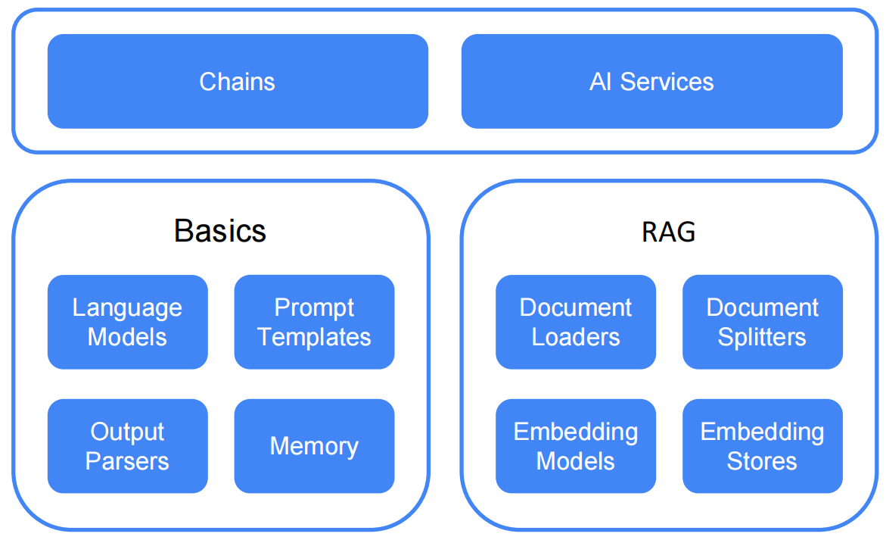
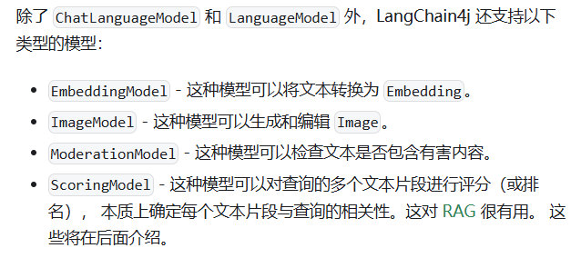
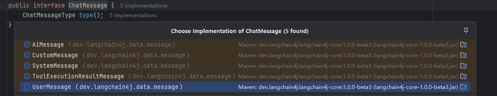
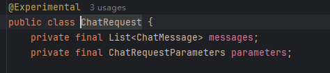
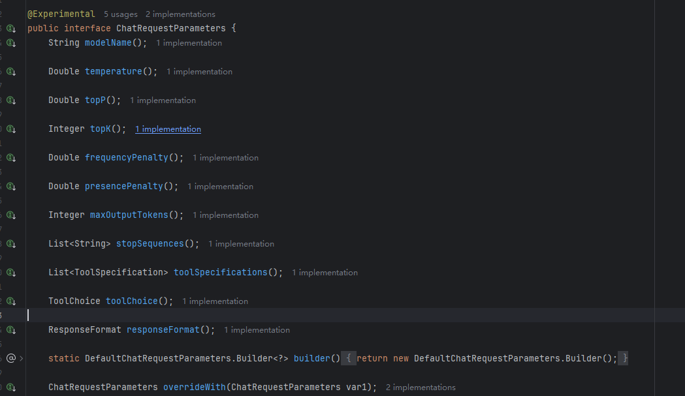
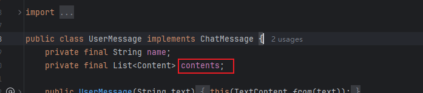

# langchain4j-demo
这里将记录自己学习langchain4j的过程

官方文档：https://docs.langchain4j.info/

简介：

1.langchain 是一个快速对接llm到自己项目的框架，能快读对接市面上大部分的模型，包括向量模型
2.langchain框架分为两个层次：一个是低层次 chains， 一个是高层次 AI Service

学习流程：

#### 聊天

聊天有两种API：
   
LanguageModel：API非常简单 - 接受 String 作为输入并返回 String 作为输出。 这种 API 现在正在被聊天 API（第二种 API 类型）所取代。
     
ChatLanguageModel： 接受多个ChatMessage作为参数传入LLM，并返回AIMessage输出

   
聊天参数：ChatRequest

ChatRequest与llm交互必要对象

此对象包含两个参数：

`private final List<ChatMessage> messages;`

`private final ChatRequestParameters parameters;`

##### 聊天有几种不同的方式来实现：

第一种： 简单的chat 

>String response  = ChatLanguageModel.chat(String)

适用范围：一次性问题咨询，一问一答，无记忆功能

第二种：使用chatMessage

>ChatResponse chatResponse = ChatLanguageModel.chat(ChatMessage)
>ChatResponse chatResponse = ChatLanguageModel.chat(List<ChatMessage>)

**ChatMessage可以是下面四个类型**

UserMessage：用户输入的问题

AiMessage：llm返回的信息

ToolExecutionResultMessage：llm返回执行工具的相关信息

SystemMessage：提示词信息

CustomMessage：自定义消息

第三种：使用chatRequest

>ChatResponse chatResponse = ChatLanguageModel.chat(ChatRequest chatRequest)

ChatRequest包含两个参数：

**parameters请求的相关参数**
是连接业务层与模型服务的关键 “配置契约”

**模型核心配置参数**

modelName：指定使用模型的名称

temperature：模型生成结果随机性，取值范围：通常为 **0.0 ~ 2.0，** 逻辑：值越高，随机性越强（内容更发散、可能出现 “脑洞”）；值越低，确定性越强（内容更聚焦、重复度可能更高

// todo找资料理解topP，还有topP和temperature的区别

topP：累积概率阈值， 控制返回候选词范围，取值范围：0.0 ~ 1.0，模型回答下一个词之前会对后面的候选的词进行筛选，这个筛选的范围

**输出长度与候选词控制参数**

// todo找资料理解topK，

topK：限制模型生成下一个词时的候选词数量，取值范围：1 ~ 1000

maxOutputTokens：最大输出 tokens 数

**输出多样性控制参数（惩罚机制）**

frequencyPenalty：频率惩罚, 

    取值范围：通常为 0.0 ~ 2.0（部分模型支持负数值，即 “鼓励重复”）,
    意思是大模型前面输出的词出现的频率越多，后续出现的概率就越低，是对高频词的惩罚。但是还是有概率出现
    ✅ 长文本生成（如文章、报告）：0.1 ~ 0.5（避免反复用相同形容词 / 句式）
    ❌ 代码生成、公式推导：不建议设过高（可能破坏语法 / 逻辑完整性）

presencePenalty：存在惩罚 “已在输出中出现过的词类型”，鼓励引入新话题
    
    取值范围：通常为 0.0 ~ 2.0，
    逻辑：只要某个词在输出中出现过（无论次数），就降低该词的选择概率，核心是 “鼓励新内容” 而非 “惩罚重复次数”
    与 frequencyPenalty 区别：
    - frequencyPenalty：针对 “重复次数”（如 “很好” 出现 3 次，惩罚递增）；
    - presencePenalty：针对 “是否出现过”（如 “很好” 出现 1 次就开始惩罚，鼓励用 “优秀”“出色” 替代）

**输出终止与格式控制参数**

stopSequences：停止序列

responseFormat：模型返回的格式，（如文本、JSON、Markdown）

    常见取值（需结合 ResponseFormat 定义）：
    TEXT：纯文本输出（默认）
    JSON：强制输出标准 JSON 格式（需模型支持，如 GPT-4 的 response_format: {"type": "json_object"}）
    MARKDOWN：按 Markdown 语法输出（如标题、列表、代码块）
    作用：减少下游解析成本，例如让模型直接输出可解析的 JSON 数据，无需额外处理格式。

**使用chatMessage，让llm变得有记忆**

执行一次会话返回的结果 ， 可以作为下次会话的输入
>ChatResponse chatResponse1 = ChatLanguageModel.chat(ChatMessage1)
>ChatResponse chatResponse2 = ChatLanguageModel.chat(ChatMessage1,chatResponse1,ChatMessage2)

ChatMessage2就会根据前面的问答获取信息，就显得有记忆，这是最初始的版本，langChain4j提供了更智能的记忆功能，使用Memory

#### 多模态对接：

多模态对接的基本要求：
1. 需要模型支持多模态对接
2. 将图片，音频，视频等用userMessage传入大模型

原理：content接口，有多种实现：textContent，imageContent，audioContent，videoContent等

> UserMessage userMessage = UserMessage.from(
> TextContent.from("Describe the following image"),
> ImageContent.from("https://example.com/cat.jpg")
> );
> ChatResponse response = model.chat(userMessage);

#### 流失对接：

流式与正常接口区别：
1. 正常接口是一次请求一次完整回复，流失是stream有一点回复就返回，然后继续返回，直到结束，所以会有很多的片段，需要处理
2. 流式接口需要使用streamingResponseHandler，处理流式返回的片段
3. 流式与正常调用大模型的方法不一样，正常是chatLanguageModel，流式是streamingChatLanguageModel，LanguageModel同理
4. streamingResponseHandler是接口，传参数是需要实现接口
5. 实现streamingResponseHandler可以使用工具类LambdaStreamingResponseHandler，用lambda表达更简单的实现

详细实例和细节见文档：https://docs.langchain4j.info/tutorials/response-streaming

#### AiService聊天：

